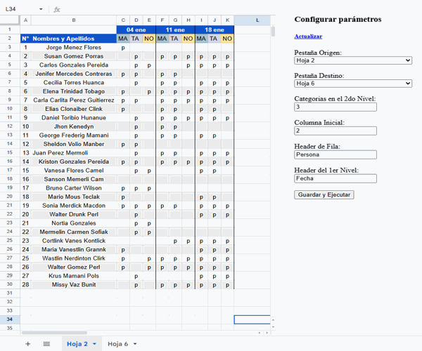
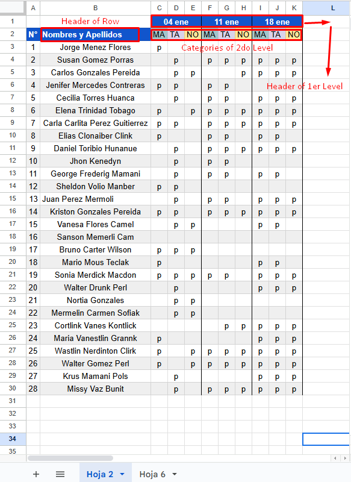

# Table Normalizer

Normalize Table is a Google Sheets extension designed to transform complex pivot tables into normalized tables. This tool simplifies data analysis by structuring information in a way that makes it easier to interpret and manipulate.

  

### Key Features:
- 🚀 Automatic Transformation: Converts pivot tables into normalized tables with a single click.
- 🎨 Customization: Allows you to adjust normalization settings to suit your needs.
- 🔗 Compatibility: Works seamlessly with any Google Sheets spreadsheet.
- 🧑‍💻 Intuitive Interface: Easy to use, even for those without technical experience.
### Benefits:
- ⏳ Saves Time: Significantly reduces the time needed to prepare data for analysis.
- ✅ Improves Accuracy: Minimizes errors by structuring data consistently.
- 📊 Facilitates Analysis: Makes data more accessible and easier to understand.

## How does it work?
Discover how Normalize Table revolutionizes your Google Sheets experience! 🚀 In this image, we show you the key parts of a pivot table that our extension magically transforms. ✨

- 👉 The "Header of Row" is the header or label that the records in the normalized table will have.
- 👉 The "Header of 1st Level" defines the column name, making it easier to identify the information.
- 👉 The "Categories of 2nd Level" represent the variety of categories present in your pivot table.

With Normalize Table, each of these elements becomes a clear and accessible structure, allowing you to analyze and manipulate your data with ease. 📊 Say goodbye to complexity and hello to simplicity in your spreadsheets! 🌟

  

